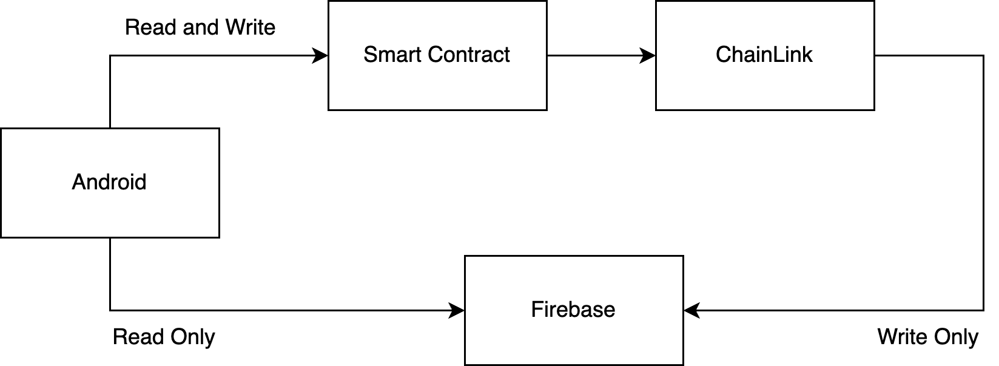

# VoteChain

This project is an application that creates and manages voting using Ethereum smart contracts.

## Architecture

### Smart Contract

The smart contract provides functions such as creating votes, voting, and ending votes. To facilitate quick retrieval on
the client side, some data such as the title, content, and creation time of the votes are copied in Firebase via
ChainLink.

[Show More](./contract)

### ChainLink

ChainLink is used to call Firebase from the smart contract. ChainLink executes JavaScript code to call Firebase with the
data received from the smart contract and returns the result.

[Show More](./contract/script)

### Android

The Android application calls the smart contract and Firebase to enable users to participate in voting. For searching
votes, it uses Firebase, while important tasks such as viewing vote statistics and participating in the voting process
are handled by calling the smart contract.

[Show More](./android)

### Firebase

Firebase is used for authentication and quick retrieval of voting data. Firestore does not store critical data such as
ballot items and vote counts, only the data necessary for searches. This design addresses the slow speed and high cost
drawbacks of smart contracts and forces the smart contract to be called to access meaningful voting data.