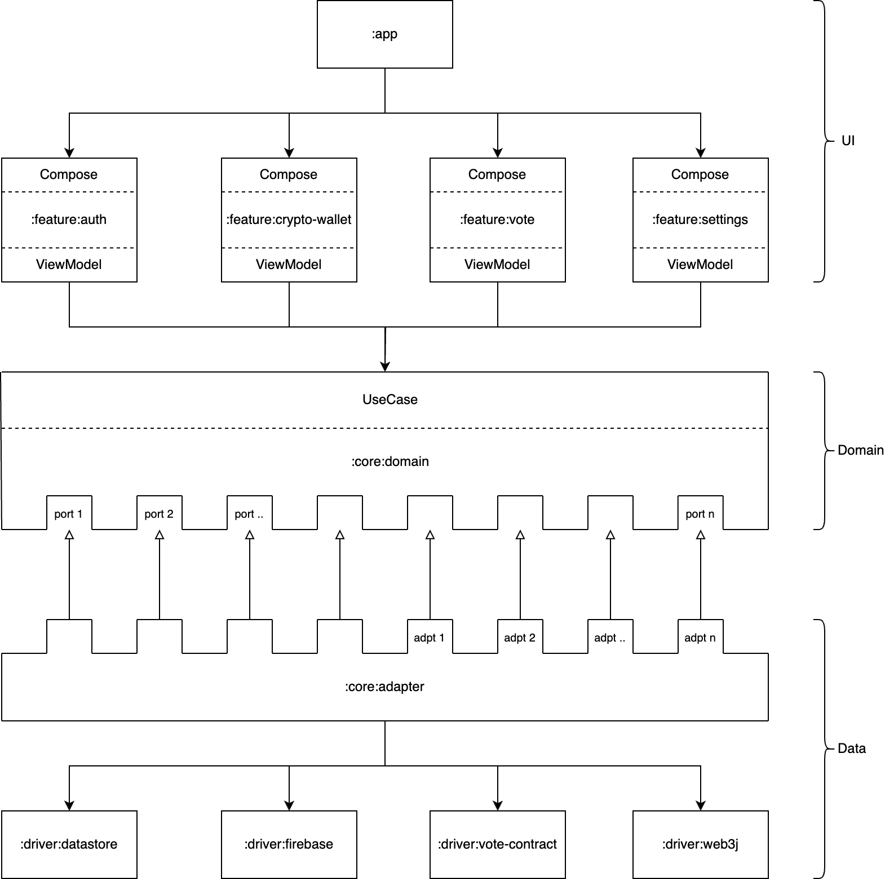

# VoteChain - Android

This document describes an Android app that provides voting functionality by integrating with
a [smart contract](../contract).

## Libraries used

| Category       | Property File Path                                                                       |
|:---------------|:-----------------------------------------------------------------------------------------|
| Jetpack        | `lifecycle` `comopse` `navigation` `paging` `hilt` `splash-screen` `startup` `datastore` |
| Third-Party UI | `coil` `lottie` `shimmer` `vico` `hilt` `grid-layout`                                    |
| Kotlinx        | `coroutine` `serialization` `immutableCollections`                                       |
| Firebase       | `auth` `firestore` `remote-config` `storage`                                             |
| Etc            | `web3j` `refreshVErsions`                                                                |

## Architecture



### App

An executable Android application module composed of submodules divided into large and small units.

### Feature

Each feature module is responsible for some of the functionalities provided within the app, such as authentication,
crypto wallet, and voting. Also provides a UI for user interaction with the app and calls use cases to access the domain
layer.

### Domain

The domain module is responsible for handling business logic and is primarily composed of three parts: Entity, UseCase,
and Port.

| Name    | Type                                                                                                                                                                                       |
|:--------|:-------------------------------------------------------------------------------------------------------------------------------------------------------------------------------------------|
| Entity  | The domain objects are defined, and the business logic is implemented                                                                                                                      |
| UseCase | It serves as the entry point (In-Port) for accessing the domain from external layers, invoking the business logic of entities and calling external drivers to meet domain requirements.    |
| Port    | The Port provides an interface (Output-Port) for accessing external drivers. This is to ensure that the domain module does not have direct dependencies on specific drivers (or services). |

### Adapter

The Adapter module is a layer that implements the Output-Port of the domain layer. It uses multiple drivers to fulfill
the contract with the domain layer.

### Driver

It is a layer that accesses external services such as Firebase, SmartContract, and Web3j for the actual operation of the
app.

## Build

The following steps need to be performed to build the project.

### 1. Create Keystore and Properties

Keystore and property files for both Release and Debug must be created and added to the project for app signing.

| File       | Property File Path                                                         |
|:-----------|:---------------------------------------------------------------------------|
| Keystore   | `./${ANDROID_ROOT}/keystore/{build-type}/{build-type}.keystore`            |
| Properties | `./${ANDROID_ROOT}/keystore/{build-type}/{build-type}-keystore.properties` |

```properties
storeFile=..
keyAlias=..
keyPassword=..
storePassword=..
```

> `./.../keystore/release/release.keystore`

> `./.../keystore/release/release-keystore.properties`

### 2. Create Smart Contract from ABI

Using Web3j, source code that can be used on the client side must be generated from
the [Contract ABI](./core/driver/vote-contract/abi/VoteContractImpl.abi) included in the
project.

```
$ cd ./${ANDROID_ROOT}/core/driver/vote-contract
```

```
web3j generate solidity -b ./abi/VoteContract.bin -a ./abi/VoteContractImpl.abi -o ./src/main/java/ -p dylan.kwon.votechain.core.driver.vote_contract
```

> Output: ./${:core:driver:vote_contract}/src/main/java/dylan/kwon/votechain/core/driver/vote_contract/VoteContractImpl.java

## Update Dependency

Update the version of external libraries by running the following command.

```
 $ ./gradlew refreshVersions 
```

> Uncomment the desired version in Update [libs.versions.toml](./gradle/libs.versions.toml)

## Convention Plugin

Reuse duplicated build scripts that arise from using multiple modules by leveraging the convention plugins of
build-logic.

[Show More](./build-logic)
