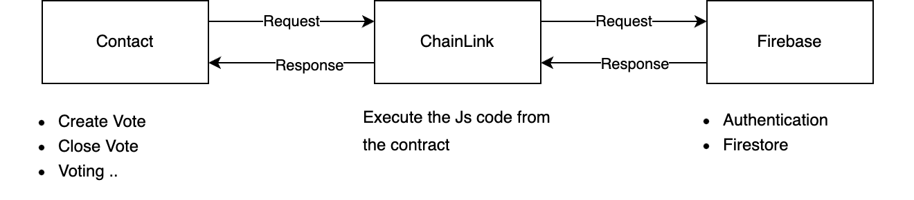
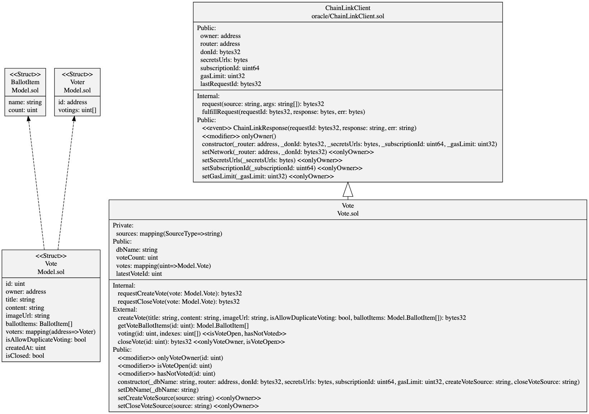

## Overview

This section describes the architecture and functionality of the voting smart contract.

## Architecture

## Class Diagram

> Generated by [sol2uml](https://github.com/naddison36/sol2uml)

## ChainLink Setup

In the smart contract, you need to set up and provide environment variables for using ChainLink, ensuring they are
encrypted.

- [Environment Setup](./script)
- [Generate Secret Key](./script/src/secrets)

## Constructor

| Name              | Type    | Description                                               | Reference                                                              |
|:------------------|:--------|:----------------------------------------------------------|:-----------------------------------------------------------------------|
| dbName            | string  | The database name of Firestore                            | `(default)` or `test`                                                  |
| router            | address | The router address of a network supported by ChainLink    | [Link](https://docs.chain.link/chainlink-functions/supported-networks) |
| donId             | bytes32 | The don id of a network supported by ChainLink            | [Link](https://docs.chain.link/chainlink-functions/supported-networks) |
| secretsUrls       | bytes   | The URL for the secret value to be used with ChainLink    | [Link](./script/src/secrets)                                           |
| subscriptionId    | uint64  | The subscription ID of ChainLink                          | [Link](https://functions.chain.link/arbitrum-sepolia)                  |
| chainLinkGasLimit | uint32  | The gas limit per call for ChainLink                      | Maximum 300,000                                                        |
| createVoteSource  | string  | The js for storing vote data in Firestore                 | [Link](./script/src/sources/firestore/vote/create)                     |
| closeVoteSource   | string  | The js for calling Firebase to change the voting end flag | [Link](./script/src/sources/firestore/vote/close)                      |

> To reduce the frequency of redeploying the smart contract, setter methods for the constructor items are provided.

## Database

| Name      | Purpose    |
|:----------|:-----------|
| (default) | Production |
| test      | Test       |

## ChainLink Customer

Once the contract is deployed, the contract address must be registered as a customer with ChainLink.
> in https://functions.chain.link/arbitrum-sepolia/${SUBSCRIPTION_ID}

## Provided Features

### Contract

| Name  | Description                         |
|:------|:------------------------------------|      
| owner | Return the contract owner's address |

### Firestore

| Name      | Description              |
|:----------|:-------------------------|
| dbName    | Return the database name |
| setDbName | Set the database name    |

### Vote

| Name               | Description                                                                        |
|:-------------------|:-----------------------------------------------------------------------------------|
| votes              | Return the voting data stored in the contract                                      |
| voteCount          | Return the number of votes created                                                 |
| lastVoteId         | Return the last created vote ID                                                    |
| createVote         | Create a new vote                                                                  |
| closeVote          | Calling this method will disable further voting on the specified vote              |
| voting             | Each account can vote only once per vote, and voting is not allowed in ended votes |
| getVoter           | Return data on which item the caller voted for                                     |
| getVoteBallotItems | Return the ballot items of the vote                                                |

### ChainLink Settings

| Name                | Description                                                                          |
|:--------------------|:-------------------------------------------------------------------------------------|
| router              | Return the router address                                                            |
| donId               | Return the don ID                                                                    |
| setNetwork          | Set the router and don ID                                                            |
| secretsUrls         | Return the secrets url                                                               |
| setSecretsUrls      | Set the secrets url                                                                  |
| subscriptionId      | Return the subscription ID                                                           |
| setSubscriptionId   | Set the subscription ID                                                              |
| lastRequestId       | The request ID generated by the most recent ChainLink call                           |
| gasLimit            | Return the gas limit                                                                 |
| setGasLimit         | Set the gas limit                                                                    |
| setCreateVoteSource | Set the JS code to create voting data in Firestore                                   |
| setCloseVoteSource  | Set the JS code to change the voting end flag to true for a vote stored in Firestore |

## Event

In the `External` method, if it changes the state and has a return value, it can be received using `eth_getlogs`.

| Name              | Description                                    |
|:------------------|:-----------------------------------------------|
| CreateVote        | Receive results after creating a vote          |
| Voting            | Receive results after voting                   |
| CloseVote         | Receive results after the vote close           |
| ChainLinkResponse | Response from the source executed by ChainLink |
