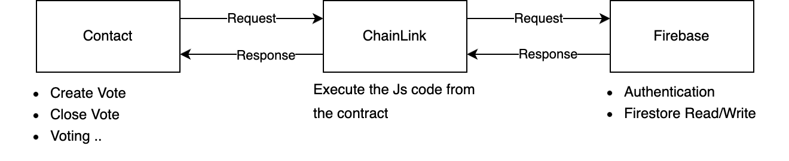

## Summary

This section describes the architecture and functionality of the voting smart contract.

## Architecture

### Contract

The contract provides functionalities such as creating votes, voting, and ending votes. To efficiently handle complex
features like sorting or searching, which are part of the user's requirements, Chainlink is used to process data
off-chain. Therefore, when the contract calls Chainlink, it must also provide the accompanying JS code that meets these
requirements.

### ChainLink

The received source code from the contract request is executed by the Decentralized Oracle Network (DON) and the results
are returned. In this project, it is used to store or modify voting data in Firestore.

### Firebase

To use case requirements such as search and sorting quickly and cost-effectively, voting data is stored in Firestore.
Only data necessary for search and sorting, such as title, content, and creation date, are stored, rather than the
entire dataset.

## Class Diagram

> Generated by [sol2uml](https://github.com/naddison36/sol2uml)

## Constructor

| Name              | Type    | Description                                               | Reference                                                              |
|:------------------|:--------|:----------------------------------------------------------|:-----------------------------------------------------------------------|
| dbName            | string  | The database name of Firestore                            | `(default)` or `test`                                                  |
| router            | address | The router address of a network supported by Chainlink    | [Link](https://docs.chain.link/chainlink-functions/supported-networks) |
| donId             | bytes32 | The don id of a network supported by Chainlink            | [Link](https://docs.chain.link/chainlink-functions/supported-networks) |
| secretsUrls       | bytes   | The URL for the secret value to be used with Chainlink    | [Link](./script/src/secrets)                                           |
| subscriptionId    | uint64  | The subscription ID of Chainlink                          | [Link](https://functions.chain.link/arbitrum-sepolia)                  |
| chainLinkGasLimit | uint32  | The gas limit per call for Chainlink                      | Maximum 300,000                                                        |
| CreateVoteSource  | string  | The js for storing vote data in Firestore                 | [Link](./script/src/sources/firestore/vote/create)                     |
| CloseVoteSource   | string  | The js for calling Firebase to change the voting end flag | [Link](./script/src/sources/firestore/vote/close)                      |

> To reduce the frequency of redeploying the smart contract, setter methods for the constructor items are provided.

## Database

| Name      | Purpose    |
|:----------|:-----------|
| (default) | Production |
| test      | Test       |

## ChainLink Customer

Once the contract is deployed, the contract address must be registered as a customer with ChainLink.
> ex) https://functions.chain.link/arbitrum-sepolia/${SUBSCRIPTION_ID}

## Provided Features

### Contract

| Name  | Description                         |
|:------|:------------------------------------|      
| owner | Return the contract owner's address |

### Firestore

| Name      | Description              |
|:----------|:-------------------------|
| dbName    | Return the database name |
| setDbName | Set the database name    |

### Vote

| Name               | Description                                                                        |
|:-------------------|:-----------------------------------------------------------------------------------|
| votes              | Return the voting data stored in the contract                                      |
| voteCount          | Return the number of votes created                                                 |
| lastVoteId         | Return the last created vote ID                                                    |
| createVote         | Create a new vote                                                                  |
| closeVote          | Calling this method will disable further voting on the specified vote              |
| voting             | Each account can vote only once per vote, and voting is not allowed in ended votes |
| getVoteBallotItems | Return the ballot items of the vote                                                |

### ChainLink Settings

| Name                | Description                                                                          |
|:--------------------|:-------------------------------------------------------------------------------------|
| router              | Return the router address                                                            |
| donId               | Return the don ID                                                                    |
| setNetwork          | Set the router and don ID                                                            |
| secretsUrls         | Return the secrets url                                                               |
| setSecretsUrls      | Set the secrets url                                                                  |
| subscriptionId      | Return the subscription ID                                                           |
| setSubscriptionId   | Set the subscription ID                                                              |
| lastRequestId       | The request ID generated by the most recent ChainLink call                           |
| gasLimit            | Return the gas limit                                                                 |
| setGasLimit         | Set the gas limit                                                                    |
| setCreateVoteSource | Set the JS code to create voting data in Firestore                                   |
| setCloseVoteSource  | Set the JS code to change the voting end flag to true for a vote stored in Firestore |
